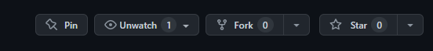
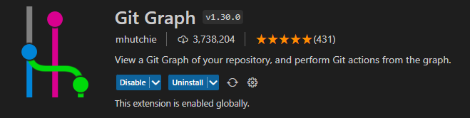
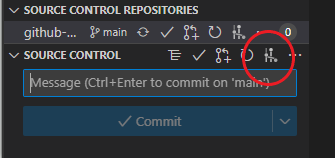
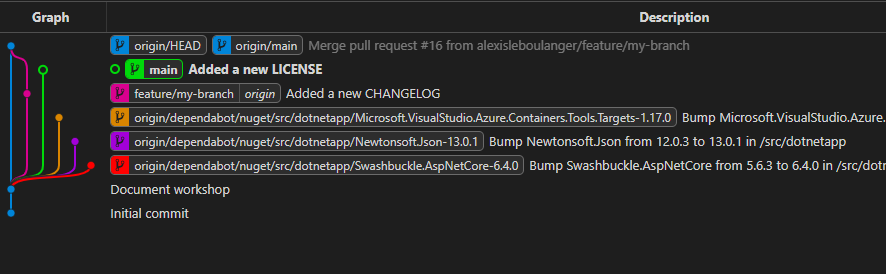

# Welcome to Insight's Workshop


[Project Docs Here](./doc/Documentation.md)

## Hi There 👋

Welcome to Insight's workshop on GitHub!

 Our team here at Insight EMEA have developed four workshops within this repository for you to explore what GitHub has to offer and how GitHub features can help improve your companies current working practices and how you can accelerate your offering from development to production.

The labs setup within the **Welcome to Insight’s Workshop** repository will provide a deep dive, hands-on experience into the below technologies and service and how you can use them to optimise your workflow:

- Git
- Pull Requests & Issues
- GitHub Actions
- GitHub Security

Each lab created within this repository has been created with a set of instructions. Continue through the.readme file to start your development...

<summary><h2> Prerequisites ✋</h2></summary>

Before we undertake this workshop, there are a few steps to carry out:

 1. Install Git onto your Lab Device [Git Install Page](https://git-scm.com/downloads)
 2. Install Visual Studio Code onto your Lab Device [VS Code Install Page](https://code.visualstudio.com/)

<summary><h2> LAB 1 - Git ⚙️</h2></summary>


### What is Git?

Git is the global leader for **Version Control Software**. It’s free and open source which means it's actively managed by the wider community and is in continuous development for improvement. Git also provides a Distributed Version Control. Each Engineer working on a version of the code repository will contain a full list of changes that have taken place within the repository. The advantage of this is that Version History is not subject to a single location leading to a single point of failure.

Git provides speed and efficiency which is one of the contributing factors on why it is the industry leading version control. Software and DevOps Engineers rely heavily on Git and its list of functionalities to help manage their project source code on a day-today basis. Some of the functionalities utilised by Engineers will cover in this lab.

### Functionalities

- [ ] `git init` (Creates a new Git Repository)
- [ ] `git clone` (Clone a Repository locally)
- [ ] `git checkout "Branch Name"` (Create a new Branch and **SWITCH TO IT**)
- [ ] `git branch` (Create a new branch)
- [ ] `git add` (Adds changes to in a aprticular file to the next commit)
- [ ] `git status` (Shows untracked files and the state of the working & staging directory)
- [ ] `git commit -m "Your Commit Message..."` (Commits staged changes to your branch associated with your commit message for auditing)
- [ ] `git push` (Upload changes from local repository to remote repository)
- [ ] `git pull` (Download changes from remote repository to local repository)
- [ ] `git log` (View history of changes in repository)

### Exercise

Lab 1 is based all around Git functionality and how engineering teams apply the above to their projects in order to manage their codebase. To do this, you are going to walk through a set of steps:

#### 1. Fork this template

1. At the top of this repository, click the **Fork** button 

2. Fill out the forking form

3. The repository will begin to create. Refresh your webpage after 30 seconds and have 2 x webpages open to view changes you commit to your forked repository.

#### Clone the solution

```sh
# create and move to a new /c/dev/git directory
cd /c/dev/git/
# clone the forked workshop
git clone "https://github.com/$user/cp-github-workshop-template.git"
```

Once cloned, git will create a standard "origin" remote pointing to this cloned url.

```sh
git remote 
# origin
git remote get-url origin
# https://github.com/$user/cp-github-workshop-template

```

Git has potitioned the HEAD on the main branch indicated by a star (main***)

```sh
 git branch
# * main
```

#### Create the new branch "feature/my-branch"

```sh
git checkout -b feature/my-branch
# equals to :
# git branch feature/my-branch
# then 
# git checkout feature/my-branch
 
 git branch
# * feature/my-branch
# main
```

#### Create a new CHANGELOG file, add, commit & push

```sh
# Create the CHANGELOG file
git add .
git commit -m "Added a new CHANGELOG"
git push -u origin feature/my-branch
# now the branch should be created on the forked repo
```

#### Vien branches with Gitgraph extension

Browse for Git Graph extension on VSCode and install :



Show the current graph :



You should see this :


You can see a new commit is child from the origin/main on the origin/feature/my-branch branch.

(we'll get to the origin/dependabot/... later...)

#### Log your changes to the CHANGELOG

```sh
# logs the latest changes you've committed
git log
# commit $guid2  (HEAD -> feature/my-branch, origin/feature/my-branch)
# Author: $user
# Date:   $date2

#     Added a new CHANGELOG

# commit $guid1 (origin/main, origin/HEAD, main)
# Author: $user
# Date:   $date1
# :q to escape
```

<summary><h2> LAB 2 - Pull Requests & Issues 🩺</h2></summary>

#### Secure de main branch

Now we'll make sure anybody cannot push anykind of code on the main branch without validation.
For that we'll set a policy on the main branch :

> Go to Settings >


> Branches >


> Add a new branch protection rule where
>
> - Only a PR can push code on the main branch
>   - Check "Require a pull request before merging"
>   - Check "Require approvals"


> Make sure yourself are not allowed to bypass these settings ;)


The main is set

#### Try add/commit/push on main branch

Lets try commit on the main branch

```sh
# Create the CHANGELOG file
git checkout main
# Add the LICENSE file
git add .
git commit -m "Added a new LICENSE"
# now the commit shall not be pushed
git push
# Enumerating objects: 4, done.
# Counting objects: 100% (4/4), done.
# Delta compression using up to 8 threads
# Compressing objects: 100% (2/2), done.
# Writing objects: 100% (3/3), 296 bytes | 296.00 KiB/s, done.
# Total 3 (delta 1), reused 0 (delta 0), pack-reused 0
# remote: Resolving deltas: 100% (1/1), completed with 1 local object.
# remote: error: GH006: Protected branch update failed for refs/heads/main.
# remote: error: Cannot change this locked branch At least 1 approving review is required by reviewers with write access.
# To https://github.com/$user/cp-github-workshop-template.git
#  ! [remote rejected] main -> main (protected branch hook declined)
# error: failed to push some refs to 'https://github.com/$user/cp-github-workshop-template.git'
```

It should fail with security in place

#### Pull Request (PR) the changes on feature/my-branch

We need to pass our commits from feature/my-branch to main branch by a standard validation process.

For that let's create a PR :

> Open the pull request menu


> Create the PR from "feature/my-branch" to main
> Don't forget to make sure the base is "main"


Now we need an assignee to validate the request. Normally it is your techlead that would just do that. But for now let's just choose ourselves (never do that ;)).

> Open the PR (if it is not already opened)
> Chose your assignee as yourself


> Chose your assignee as yourself
> 


Observe you cannot approve your own PR !! 

> Either ask for a friend and set him as a reviewer to approve your code
> Or unset the branch protection "Require approval" policy on "main branch"

Now you can merge !!


Confirm the merge with a merge commit specific comment


The merge is done


Check with git graph the result

```sh
# Fetching the new changes without applying them
git fetch
```

See the result on graph


Well done !!!

#### Approve/Merge the changes from feature/my-branch to main

#### See the added CAHNGELOG on main

<summary><h2> LAB 3 - GitHub Actions 💥</h2></summary>

#### Add to workflow/job

Add a .github/workflows/build.yml with a job section

#### Add templated code to action

```yml
#.net build yml code to copy into .github/workflows/build.yml
name: dotnet build action

on: [push]

jobs:
  build:

    runs-on: ubuntu-latest
    steps:
      - uses: actions/checkout@v3

      - name: Setup .NET Core SDK '5.0.x' 
        uses: actions/setup-dotnet@v3
        with:
          dotnet-version: '5.0.x'

      - name: Install dependencies
        working-directory: ./src/dotnetapp
        run: dotnet restore

      - name: Build
        working-directory: ./src/dotnetapp
        run: dotnet build --configuration Release --no-restore
```

#### Push job and execute


<summary><h2> LAB 4 - GitHub Security 🔒</h2></summary>

#### Dependency Graph

Show .net nuget dependencies

#### Activate dependabot

Bump dependency issues

#### Secret security

Scan/Find secret sowhere in code
Move it to GitHub secrets

#### Activate CodeQL scan

Solve issues

#### Push job and execute

