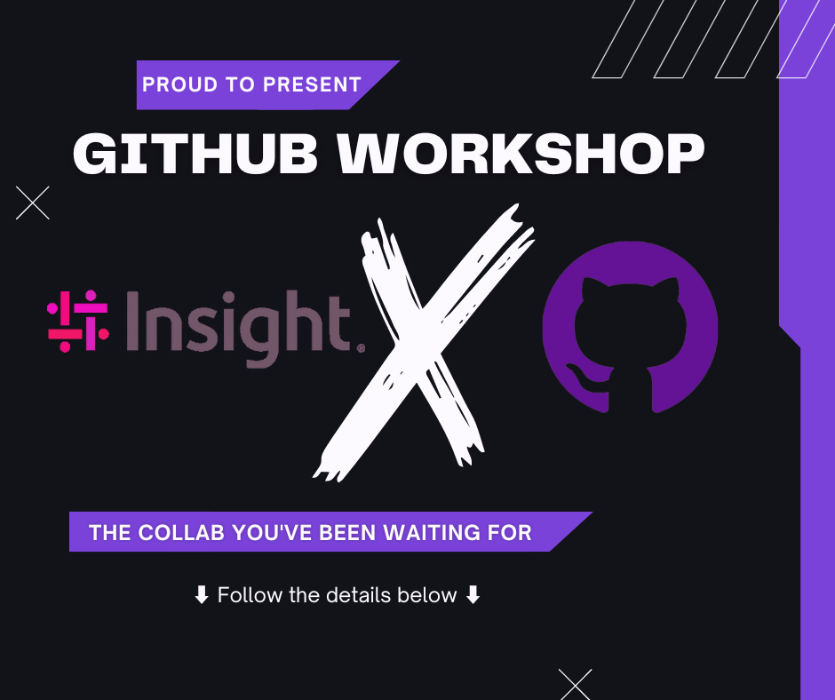

# Welcome to Insight's Workshop



## Hi There 👋

Welcome to Insight's workshop on GitHub!

 Our team here at Insight EMEA have developed four workshops within this repository for you to explore what GitHub has to offer and how GitHub features can help improve your companies current working practices and how you can accelerate your offering from development to production.

The labs setup within the **Welcome to Insight’s Workshop** repository will provide a deep dive, hands-on experience into the below technologies and service and how you can use them to optimise your workflow:

- Git
- Pull Requests & Issues
- GitHub Actions
- GitHub Security

Each lab created within this repository has been created with a set of instructions. Continue through the.readme file to start your development...

<details id=1 open>
<summary><h2> Prerequisites ✋</h2></summary>

Before we undertake this workshop, there are a few steps to carry out:

 1. Install Git onto your Lab Device [Git Install Page](https://git-scm.com/downloads)
 2. Install Visual Studio Code onto your Lab Device [VS Code Install Page](https://code.visualstudio.com/)

</details>

<details id=2 > 
<summary><h2> LAB 1 - Git ⚙️</h2></summary>


### What is Git?

Git is the global leader for **Version Control Software**. It’s free and open source which means it's actively managed by the wider community and is in continuous development for improvement. Git also provides a Distributed Version Control. Each Engineer working on a version of the code repository will contain a full list of changes that have taken place within the repository. The advantage of this is that Version History is not subject to a single location leading to a single point of failure.

Git provides speed and efficiency which is one of the contributing factors on why it is the industry leading version control. Software and DevOps Engineers rely heavily on Git and its list of functionalities to help manage their project source code on a day-today basis. Some of the functionalities utilised by Engineers will cover in this lab.

### Functionalities

- [ ] git init/clone
- [ ] git checkout "**Branch Name**"
- [ ] git branch
- [ ] git add
- [ ] git commit -m "**Your Commit Message...**"
- [ ] git status
- [ ] git push
- [ ] git pull
- [ ] git log

### Exercise

Lab 1 is based all around Git functionality and how engineering teams apply the above to their projects in order to manage their codebase. To do this, you are going to walk through a set of steps:

#### Fork the template

#### Clone the solution

```sh
git clone "url.git"
```

#### Create the new branch "feature/my-branch"

```sh
git checkout -b feature/my-branch
```

#### Create a new CHANGELOG file, add, commit & push

```sh
# Create the CHANGELOG file
git add .
git commit -m "Added a new CHANGELOG"
git push -u origin feature/my-branch
# now the branch should be created on th e forked repo
```

#### Log your changes to the CHANGELOG

```sh
git log
# logs the latest changes you've committed
# :q to escape
```

</details>

<details id=3 open> 
<summary><h2> LAB 2 - Pull Requests & Issues 🩺</h2></summary>

#### Secure de main branch

- Only the learner can push code on the main branch
- Only a PR can push code on the main branch

Setting > Branches > Protection Rules

Add a rule for main branch

- Require a PR
- Require approval
- Lock branch

(set an action validating when done)

#### Try add/commit/push on main branch

It should fail with security in place

#### PR the changes on feature/my-branch

#### Approve/Merge the changes from feature/my-branch to main

#### See the added CAHNGELOG on main


</details>

<details id=4 open> 
<summary><h2> LAB 3 - GitHub Actions 💥</h2></summary>

#### Add to workflow/job

Add a .github/workflows/build.yml with a job section

#### Add templated code to action

```yml
#.net build yml code to copy into .github/workflows/build.yml
name: dotnet build action

on: [push]

jobs:
  build:

    runs-on: ubuntu-latest
    steps:
      - uses: actions/checkout@v3

      - name: Setup .NET Core SDK '5.0.x' 
        uses: actions/setup-dotnet@v3
        with:
          dotnet-version: '5.0.x'

      - name: Install dependencies
        working-directory: ./src/dotnetapp
        run: dotnet restore

      - name: Build
        working-directory: ./src/dotnetapp
        run: dotnet build --configuration Release --no-restore
```

#### Push job and execute


</details>

<details id=5 open> 
<summary><h2> LAB 4 - GitHub Security 🔒</h2></summary>

</details>

#### Dependency Graph

Show .net nuget dependencies

#### Activate dependabot

Bump dependency issues

#### Secret security

Scan/Find secret sowhere in code
Move it to GitHub secrets

#### Activate CodeQL scan

Solve issues

#### Push job and execute


# GitHub Discovery Workshop

## Presentation Deck

[Presentation deck](https://insightonlinegbr.sharepoint.com/:p:/s/TechnologySolutionsGroup/EfTdLyllrqVEnyJGv5Rp4ZsBbePoSwe8Kf3Zvdm3OAt4sw?e=mWPwMx)

Delivery Length approx 4h
1/1h30 : Slides
2h30/3 : Slides

## Workshop Demo

### Buildiing the Demo

Create a template Github repo
Prepare a README.md
 >> instructions
4 Labs

- 1 Git (30mn)
- 1 Github Action  (30mn)
  - Eventually --> create Lab completion actions
- 1 PR and issues  (30mn)
- 1 GitHub security  (30mn)

---------------------------------------------
2h
Define the execises

- Focus on Github feature
- Triggers
- Issue --> PR --> merge
- Branch policies
- Use dependabot,  scan code with codeql.yml workflows…..
- Base this on the pres
- Try create actions that interacts with the README.md file to upade the workshop during exercises completion

### During the demo

Fork the github template
Git stuff

- Clone
- Commit
- Push
- Add Remote --> ex: github, and az devops same time
- Commits Push

Prepare --> wait until dependabot pops the PR
Security dependabot

- PR
  